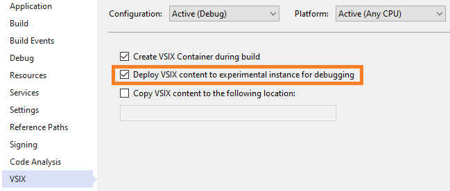

A VSIX package is a .vsix file that contains one or more Visual Studio extensions, together with the metadata Visual Studio uses to classify and install the extensions. The VSIX package format follows the Open Packaging Conventions (OPC) standard which means it can be opened by any tool that can open ZIP files.

## [File structure](#file-structure)
When creating a new extensions using the **VSIX Project w/Command (Community)** template, this is what the file structure looks like:

The main file is the **.vsixmanifest** file. It's an XML file containing information about the extension used by Visual Studio. All components of the extension are registered in the .vsixmanifest file. This is the only mandatory file in a VSIX project.

The **VSCommandTable.vsct** file is where commands are declared. It's an XML file and contains the definitions of button commands, menus, keyboard shortcut bindings and more. The file compiles its content into a blob in the output .dll that Visual Studio uses to constructs its entire command table menu structure. This file only declares the components in the command table; it doesn't handle any command invocations.

The **\*Package.cs** file is the Package class which is the entry point for most extensions. In here you often find command handlers, tool windows, options pages, services, and other components registered.

## [Compilation](#compilation)
The project compiles into a .vsix file located in the */bin/debug* or */bin/release* folder depending on your current solution build configuration. The *Visual Studio extension development* [workload](get-the-tools.html) provides dedicated MSBuild targets and tasks to handle the VSIX project flavor.

When the VSIX project builds, it automatically deploys itself to the Experimental Instance. This can be controlled in the VSIX project settings: 

## [Experimental Instance](#experimental-instance)
To safeguard your Visual Studio development environment from untested applications that might change it, the VS SDK provides an experimental space that you can use to experiment. You develop new applications by using Visual Studio as usual, but you run them by using this Experimental Instance.

Every application that has a VSIX package launches the Visual Studio experimental instance in debug mode.

If you want to start the experimental instance of Visual Studio outside a specific solution, run the following command at the command window:

`devenv.exe /RootSuffix Exp`

For more extensibility concepts, check out the [useful resources](useful-resources.html) which will come in handy for following this cookbook.
