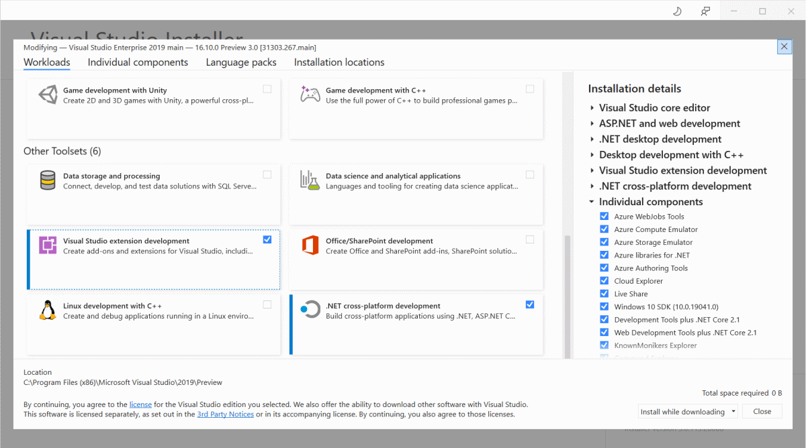
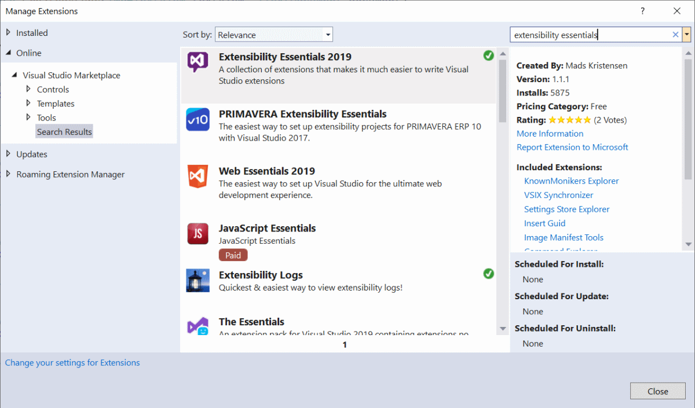

To write extensions you have to install the extensibility workload. That's technically all you need, but this set of documentation make use of the community driven extension called [Extensibility Essentials](https://marketplace.visualstudio.com/items?itemName=MadsKristensen.ExtensibilityEssentials2019).  

<iframe src="https://www.youtube-nocookie.com/embed/_3j18YsyXGM?list=PLReL099Y5nRdz9jvxuy_LgHFKowkx8tS4&color=white" title="YouTube video player" allowfullscreen></iframe>

## [Install extensibility workload](#install-extensibility-workload)

Open the *Visual Studio Installer* from **Tools -> Get Tools and Features...** top menu inside Visual Studio and make sure to install the *Visual Studio extension development* workload found toward the bottom.

## [Install Extensibility Essentials](#install-extensibility-essentials)
Install the [Extensibility Essentials](https://marketplace.visualstudio.com/items?itemName=MadsKristensen.ExtensibilityEssentials2019) by going to **Extensions -> Manage Extensions** and search for *extensibility*.

That's it, you are now ready to start developing [your first extension](your-first-extension.md).
