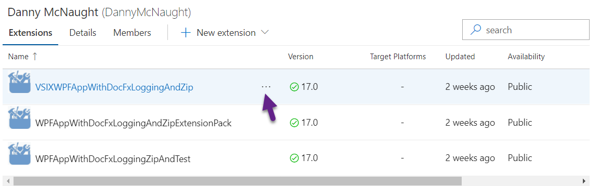
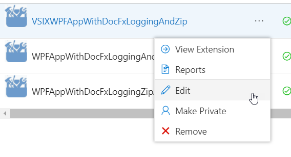
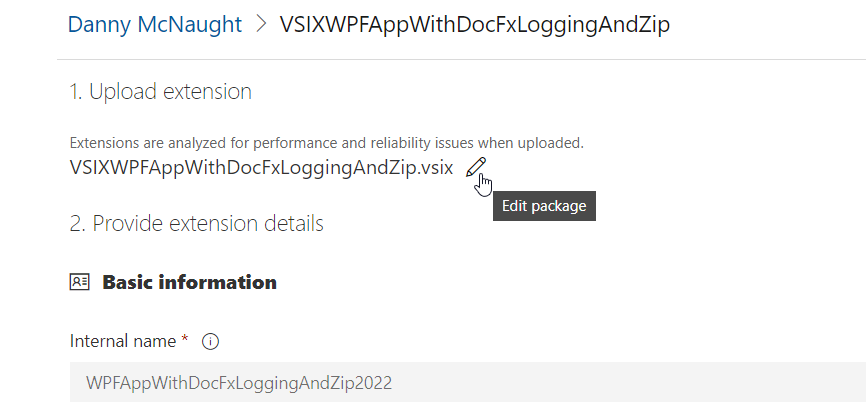
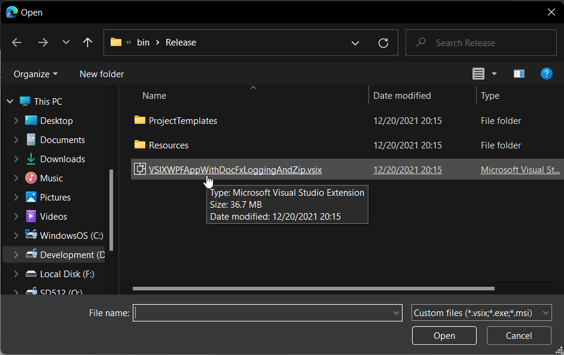
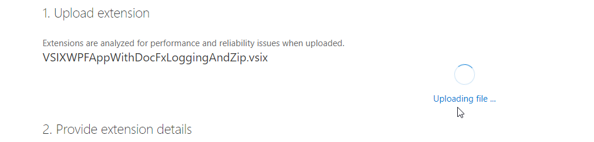
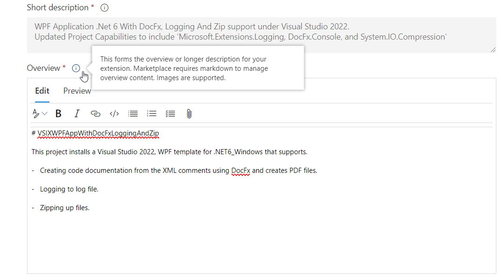
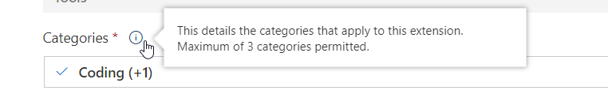
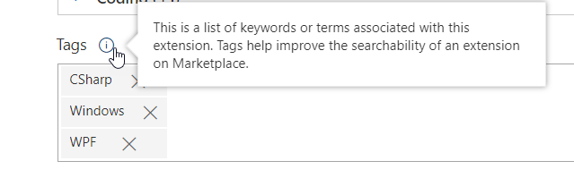
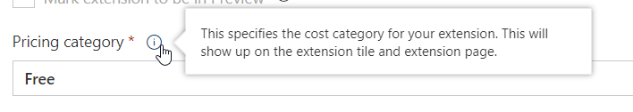
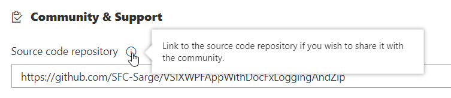

<iframe src="https://www.youtube-nocookie.com/embed/4lXH4EmzMzU?list=PLReL099Y5nRdz9jvxuy_LgHFKowkx8tS4&color=white" title="YouTube video player" allowfullscreen></iframe>

After you have published your extension, publishing updates to your extension is also very easy to do.

## [To publish an update of your extension to Marketplace](#publish-update-extension-to-marketplace)

1. In Visual Studio, open the solution for the extension you want to update. Make the changes.

>  Important
> 
> Unsigned all user extensions do not get updated automatically. You should always sign your extensions.

2. In Solution Explorer, open source.extension.manifest.

3. In the manifest designer, increase the value of the number in the Version field.

4. Save the solution and build it.

5. Upload the new .vsix file (in the *\bin\release* folder of the project) to the [Visual Studio Marketplace](https://marketplace.visualstudio.com/vs) Web site.

## [How to update your extension in the Marketplace?](#How-To-publish-update-extension-to-marketplace)

1. Sign in to Marketplace using your current [Visual Studio Marketplace](https://marketplace.visualstudio.com/vs) account.

2. Click the [Publish extensions](https://marketplace.visualstudio.com/manage)

3. Click the Three dots to the right of the extension you want to update.

4. Click Edit.

5. Click the Pencil.

6. In the Open Dialog, browse to your updated extension's vsix file and select it, Click open if required.

7. You will see Uploading file...

8. Update Overview if required for changes.

9. Update Categories if required for changes.

10. Update Tags if required for changes.

11. Update Pricing category if required for changes.

12. Update Source code repository URL if required for changes.

13. Click Save and Upload button to publish your new updated extension to the Marketplace. 

## [Users of your extension will now see your update is available](#User-update-extension)

When a user who has an earlier version of the extension opens Extensions and Updates, the new version will appear in the Updates list, provided that the tool is set to automatically look for updates.

You can enable or disable automatic checking for updates at the bottom of the Updates pane (Enable/disable automatic detection of available updates), which changes the Check for updates setting in Tools > Options > Environment > Extensions and Updates.

> Note
> 
> Starting in Visual Studio 2015 Update 2, you can specify (in Tools > Options > Environment > Extensions and Updates) whether you want automatic updates for per-user extensions, all user extensions or both (the default setting).

