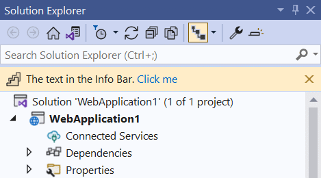
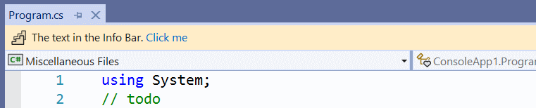
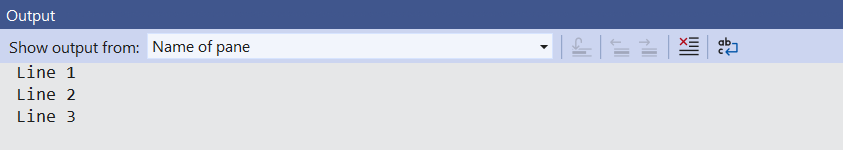

There are several mechanisms for displaying notifications to the user of your extension. Picking the right one can be challenging, so let's look at the options.

1. Status bar
2. Info bar
3. Message box
4. Output window

They are used for different purposes and have different levels of demand on the users attention.

Use the **status bar** to inform the user of an event that doesn't require any action or input from the user. If they miss the notification in the status bar, then that's ok - it wasn't critical for them to see it.

If you want to grab the attention of the user and present them with some actions for them to tak, use the **info bar**. They don't have to do it right away, they can wait until they are done with what they are doing. The notification is important, but not critical.

When the notification must block the current user from continuing what they are doing, use a **message box**. This is a blocking and critical notification.

To inform the user about non-critical errors, use the **Output Window**. You can bring focus to the Output Window if you want to make sure the users sees it, but it is recommended that you don't.

## [Status bar](#status-bar)
A status bar is an area at the bottom of a primary window that displays information about the current window's state (such as what is being viewed and how), background tasks (such as printing, scanning, and formatting), or other contextual information (such as selection and keyboard state).


Use the status bar when you don't need to take the full attention of the user, but still give them information.

### [Set the text](#set-the-text)
This will set the text in the statusbar to any string.

```csharp
// call it from an async context
await VS.Notifications.SetStatusbarTextAsync("My text");

// or from a synchronous method:
VS.Notifications.SetStatusbarTextAsync("My text").FireAndForget();
```

### [Animation icon](#animation-icon)
Adding an animation icon to the status bar is easy.


Simply specify which animation icon to use.

```csharp
// call it from an async context
await VS.Notifications.StartStatusbarAnimationAsync(StatusAnimation.Sync);

// or from a synchronous method:
VS.Notifications.StartStatusbarAnimationAsync(StatusAnimation.Sync).FireAndForget();
```

Stop the animation again by calling `EndStatusbarAnimationAsync`.

```csharp
// call it from an async context
await VS.Notifications.EndStatusbarAnimationAsync(StatusAnimation.Sync);

// or from a synchronous method:
VS.Notifications.EndStatusbarAnimationAsync(StatusAnimation.Sync).FireAndForget();
```

## [Info bar](#info-bar)
An Info Bar is a yellow bar at the top of a tool- or document window. It's useful for grabbing the attention of the user without blocking them. An Info Bar can contain an icon, text, and several hyperlinks.



Here's how to add an Info Bar to the Solution Explorer tool window.

```csharp
var model = new InfoBarModel(
    new[] {
        new InfoBarTextSpan("The text in the Info Bar. "),
        new InfoBarHyperlink("Click me")
    },
    KnownMonikers.PlayStepGroup,
    true);

InfoBar infoBar = VS.Notifications.CreateInfoBar(ToolWindowGuids80.SolutionExplorer, model);
infoBar.ActionItemClicked += InfoBar_ActionItemClicked;
await infoBar.TryShowInfoBarUIAsync();

...

private void InfoBar_ActionItemClicked(object sender, InfoBarActionItemEventArgs e)
{
    ThreadHelper.ThrowIfNotOnUIThread();

    if (e.ActionItem.Text == "Click me")
    {
        // do something
    }
}
```

To add an Info Bar to a document window, simply pass in a file name of an open document to the `VS.Notifications.CreateInfoBar(fileName, model)` method.



If you want to the Info Bar directly to an `ITextView`, then you can do that with this handy extension method:

```csharp
InfoBar infoBar = textView.CreateInfoBar(model);
```

## [Message box](#message-box)
There are various ways of showing a message box using .NET. For instance through Windows Forms or WPF. They cause some issues in Visual Studio extensions with parenting correctly against the main window, so it is recommended to use Visual Studio's own message box.


Use a message box when you need to block the UI to get the full attention of the user.

```csharp
// Simple text box
VS.Notifications.ShowMessage("Title", "The message");

// With buttons defined
VS.Notifications.ShowMessage("Title", "The message", OLEMSGICON.OLEMSGICON_INFO, OLEMSGBUTTON.OLEMSGBUTTON_OKCANCEL);   
```

## [Output Window](#output-window)
Use the Output Window to display information about exceptions and other textual information.



Creating a custom Output Window pane and write to it is straight forward when using the ` VS.Windows.CreateOutputWindowPaneAsync` method.

```csharp
OutputWindowPane pane = await VS.Windows.CreateOutputWindowPaneAsync("Name of pane");
await pane.WriteLineAsync("Line 1");
await pane.WriteLineAsync("Line 2");
await pane.WriteLineAsync("Line 3");

```

See the [Error handling recipe](error-handling.html) for more info on logging exceptions.
