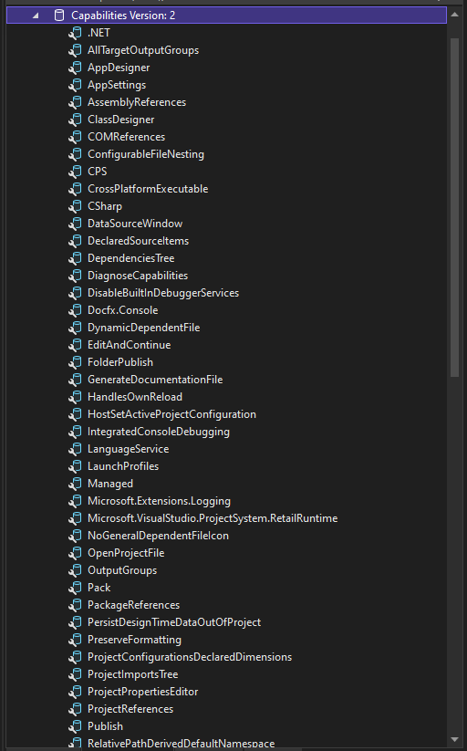

Here's a collection of small code samples on different ways to work with projects.

## [Get project from contained file](#get-project-from-file)
This is how to get the project from one if its files.

```csharp
 string fileName = "c:\\file\\in\\project.txt";
 PhysicalFile item = await PhysicalFile.FromFileAsync(fileName);
 Project project = item.ContainingProject;
```

## [Add files to project](#add-files-to-project)
Here's how to add files from disk to the project.

```csharp
Project project = await VS.Solutions.GetActiveProjectAsync();

var file1 = "c:\\file\\in\\project\\1.txt";
var file2 = "c:\\file\\in\\project\\2.txt";
var file3 = "c:\\file\\in\\project\\3.txt";

await project.AddExistingFilesAsync(file1, file2, file3);
```

## [Find type of project](#find-type-of-project)
Find out what type of project you're dealing with.

```csharp
bool isCsharp = await project.IsKindAsync(ProjectTypes.CSHARP);
```

## [Find Current Project Template Capabilities](#capabilities-of-project)
To find out what capabilities the current open project template supports. 

> Note: For SDK Style project files only.


Edit your project file and add this to your project file.

```xml
<ItemGroup>
    <ProjectCapability Include="DiagnoseCapabilities" />
</ItemGroup>
```

When you save your project file, it will show this in Solution Explorer.


In Solution Explorer if you expand the Capabilities element you will see all the support project template capabilities.



## [Add Project Template Capabilities to your own templates](#add-capabilities-to-project)
Experienced Developers or Visual Studio 2022 Template Developers.

How to update your Visual Studio 2022 Custom Project Template Extensions to provide Custom Project Capabilities.
If you are the owner of the Custom or built in Visual Studio Project Template you can very easily add Project Capabilities to your project template.

It's very important that project capabilities you define fit this [criteria](https://github.com/Microsoft/VSProjectSystem/blob/master/doc/overview/about_project_capabilities.md):

> IMPORTANT: You must follow the  [criteria](https://github.com/Microsoft/VSProjectSystem/blob/master/doc/overview/about_project_capabilities.md) requirements.

Open you Visual Studio SDK Style Project Template (Note: This is the project template .csproj contained in the Visual Studio Extension Project located under the ProjectsTemplates folder.) You may need to unzip the Project Template to get access to the .csproj file.

Open the .csproj file for your SDK Style project. It should look similar to this .csproj snippet Note: This snippet sample already has Custom Project Capabilities added.

```xml
<Project Sdk="Microsoft.NET.Sdk">

  <PropertyGroup>
    <OutputType>WinExe</OutputType>
    <TargetFramework>net6.0-windows</TargetFramework>
    <UseWPF>true</UseWPF>
    <Platforms>x64</Platforms>
    <RuntimeIdentifier>win10-x64</RuntimeIdentifier>
    <AssemblyVersion>1.0.0.0</AssemblyVersion>
	  <FileVersion>1.0.0.0</FileVersion>
	  <StartupObject>$safeprojectname$.App</StartupObject>
  </PropertyGroup>
	<ItemGroup>
		<ProjectCapability Include="DiagnoseCapabilities" />
		<ProjectCapability Include="Microsoft.Extensions.Logging" />
		<ProjectCapability Include="Docfx.Console" />
		<ProjectCapability Include="System.IO.Compression"/>
	</ItemGroup>
```

Now to add the Custom Project Capabilities to the .csproj file.

```xml
<ItemGroup>
	<ProjectCapability Include="DiagnoseCapabilities" />
	<ProjectCapability Include="Microsoft.Extensions.Logging" />
	<ProjectCapability Include="Docfx.Console" />
	<ProjectCapability Include="System.IO.Compression"/>
</ItemGroup>

```

The DiagnoseCapabilities option will list all current available Project Templates in your Project under Solution Explorer. If you do not want to always list all the Project Capablities in your deployed template then remove this line.

```xml
<ProjectCapability Include="DiagnoseCapabilities" />

```


The remaining ProjectCapability lines will show listed in your projects deploy template. These are examples and should not be included unless your project template supports them.

For example: If you had [VSIXWPFAppWithDocFxLoggingAndZip](http://example.com) project template installed.

The above example has the ProjectCapabilitiy listed so with project loaded based on that template, Help Explorer will display these links: (Note: Right below the Project name in Solution Explorer the first ProjectCapability list shows up as "Capablilities Version: 2" the version can be ignored.)

