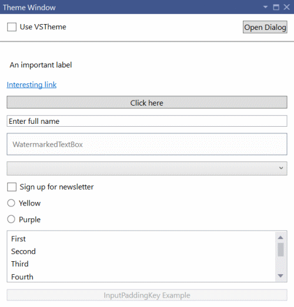
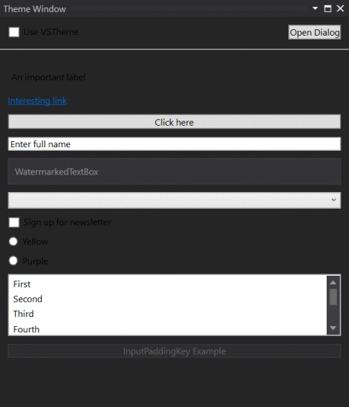
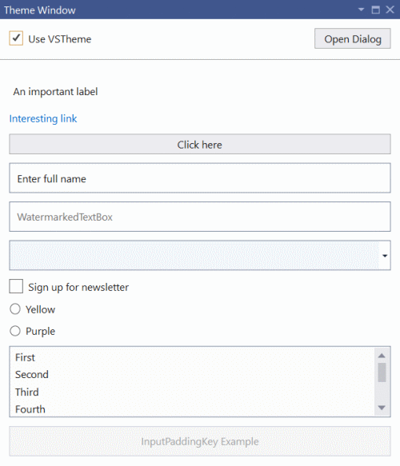
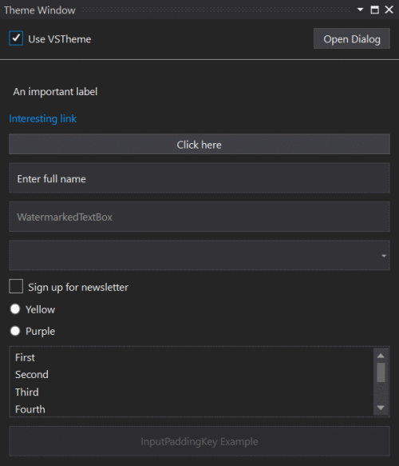

Whenever you are building any custom UI using WPF, you need to make sure it matches the theming of Visual Studio. That way your UI will look native and feel more like a natural part of Visual Studio. If not, your tool windows and dialogs might end up looking like this in the Light theme:



Notice how the padding around text boxes and buttons doesn't look right? It gets even worse in the Dark theme:



Now the text and the background colors make it almost impossible to read. Not good.

There's an easy way to make sure that our UI's background colors, button styling, etc. matches that of Visual Studio's with a simple little trick. That way the same UI can look like this in the Light theme:



Or in the Dark theme:



That looks much better. Let's look at how we can theme our UI.

## [WPF UserControl](#wpf-usercontrol)
Here's an example of a WPF `<UserControl>` that can be used directly inside a tool window.

```xml
<UserControl x:Class="TestExtension.RunnerWindowControl"
             xmlns="http://schemas.microsoft.com/winfx/2006/xaml/presentation"
             xmlns:x="http://schemas.microsoft.com/winfx/2006/xaml"
             xmlns:mc="http://schemas.openxmlformats.org/markup-compatibility/2006"
             xmlns:d="http://schemas.microsoft.com/expression/blend/2008"
             xmlns:toolkit="clr-namespace:Community.VisualStudio.Toolkit;assembly=Community.VisualStudio.Toolkit"
             toolkit:Themes.UseVsTheme="True"
             mc:Ignorable="d"
             d:DesignHeight="300" d:DesignWidth="300"
             Name="MyToolWindow">
```

Notice the `xmlns:toolkit` imported namespace and the `toolkit:Themes.UseVsTheme="True"` attribute. They will automatically apply the official styling for WPF controls that Visual Studio uses itself. We don't have to do anything else to get the styling applied.

An added benefit is that when the user changes the color theme from e.g. Light to Dark, then our UI will switch immediately as well without the need to reload.

## [DialogWindow control](#dialogwindow-control)
Visual Studio ships with a control we can use for custom windows, which is the `DialogWindow` control. It is recommended you use that for any dialog windows, but it can also be used inside tool windows.

It's very similar to other XAML window types.

```xml
<platform:DialogWindow 
    x:Class="TestExtension.ThemeWindowDialog"
    xmlns="http://schemas.microsoft.com/winfx/2006/xaml/presentation"
    xmlns:x="http://schemas.microsoft.com/winfx/2006/xaml"
    xmlns:mc="http://schemas.openxmlformats.org/markup-compatibility/2006" 
    xmlns:d="http://schemas.microsoft.com/expression/blend/2008" 
    xmlns:platform="clr-namespace:Microsoft.VisualStudio.PlatformUI;assembly=Microsoft.VisualStudio.Shell.15.0"
    xmlns:toolkit="clr-namespace:Community.VisualStudio.Toolkit;assembly=Community.VisualStudio.Toolkit"
    xmlns:local="clr-namespace:TestExtension"
    mc:Ignorable="d" 
    Width="400"
    Height="600"
    d:DesignHeight="450" d:DesignWidth="800"
    d:DataContext="{d:DesignInstance Type={x:Type local:ThemeWindowDialogViewModel}, IsDesignTimeCreatable=False}"
    toolkit:Themes.UseVsTheme="{Binding UseVsTheme}">
```

Notice the imported namespaces for both the toolkit and the platform.

That's all there is too it. 

## [Get the source code](#source-code)
You can find the source code for this extension in the [Community Toolkit test project](https://github.com/VsixCommunity/Community.VisualStudio.Toolkit/tree/master/test/VSSDK.TestExtension).

## [Additional resources](#additional-resources)
Learn more about Visual Studio colors from these resources.

* [Colors and styling for Visual Studio](https://docs.microsoft.com/visualstudio/extensibility/ux-guidelines/colors-and-styling-for-visual-studio)
* [Shared colors for Visual Studio](https://docs.microsoft.com/visualstudio/extensibility/ux-guidelines/shared-colors-for-visual-studio)
* [Color value reference](https://docs.microsoft.com/visualstudio/extensibility/ux-guidelines/color-value-reference-for-visual-studio)
